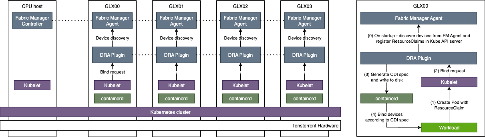

# tt-dra-driver

A [Dynamic Resource Allocation (DRA)][dra] driver for Tenstorrent devices.

This repository contains a Kubernetes resource driver that advertises and
allocates Tenstorrent accelerators (Wormhole, Blackhole, ...) to Pods through
the DRA API. It follows the structure and best-practices established by the
upstream [`kubernetes-sigs/dra-example-driver`][example-driver].

> [!IMPORTANT]
> This is the early bootstrap of the project. Only the kubelet-plugin
> skeleton, build system, and Helm chart scaffolding are wired up. The
> `tenstorrent` profile discovers ASICs by calling the Tenstorrent Fabric
> Manager (TTFM) agent's `GetTopology` RPC on the same node; per-device CDI
> container edits are still left to follow-up work.

## Architecture

DRA Plugin daemonset connects to Fabric Manager Agent's local discovery endpoint to enumarate and register ResourceSlices.



## Allocatable units

The driver advertises the same hardware at two granularities:

* **chips** — one device per MMIO-anchored chip bundle, in the
  `tenstorrent.com` DeviceClass (extended resource `tenstorrent.com/chip`).
* **trays** — one device per physical tray, in the `tray.tenstorrent.com`
  DeviceClass (extended resource `tenstorrent.com/tray`). Allocating it hands
  the container every chip on the tray.

The two are mutually exclusive per tray: a tray cannot be allocated while any
of its chips is in use, and no chip of a tray can be allocated while the tray
is. This is expressed with DRA partitionable-device shared counters, so the
scheduler enforces it. It needs the `DRAPartitionableDevices` feature gate
(default on since Kubernetes 1.36); when the API server drops the counters the
driver logs an error and publishes chips only. Trays can also be turned off
with `--enable-tray-devices=false` (Helm: `kubeletPlugin.trayDevices=false`).

See [docs/single-host.md](docs/single-host.md) for claim recipes and the full
attribute reference.

## Usage example
Create ResourceClaim targeting specific device by unique ID, for example:
```
---
apiVersion: resource.k8s.io/v1
kind: ResourceClaim
metadata:
  name: onechip
spec:
  devices:
    requests:
      - name: chip
        exactly:
          deviceClassName: tenstorrent.com
          selectors:
            - cel:
                expression: 'device.attributes["tenstorrent.com"].uniqueID == "18080982798508798832"'
```

Create Pod with tt-metal upstream container targeting the resource claim:
```
apiVersion: v1
kind: Pod
metadata:
  name: onechip-pod
spec:
  containers:
    - name: ctr
      image: ghcr.io/tenstorrent/tt-metal/upstream-tests-bh:v0.72.0-dev20260519-42-gee154fec28d
      command: ["sleep", "infinity"]
      resources:
        claims:
          - name: onechip
  resourceClaims:
    - name: onechip
      resourceClaimName: onechip
```


## Repository layout

```
.
├── cmd/
│   └── tt-dra-driver-kubeletplugin/   # Kubelet plugin entrypoint and main loop
│       ├── main.go, driver.go, ...
├── deployment/
│   ├── flux.yaml                      # Flux deployment manifest
├── docker/
│   ├── Dockerfile                     # Production Dockerfile
│   ├── Dockerfile.devel               # Dev/builder image for `make docker-*`
│   └── Makefile                       # Helper Makefile for docker builds
├── helm/
│   └── tt-dra-driver/
│       ├── Chart.yaml, values.yaml    # Helm chart for cluster-side install
│       └── templates/                 # Helm templates (RBAC, DaemonSet, etc.)
├── internal/
│   ├── fabricmanager/                 # Tenstorrent Fabric Manager gRPC client
│   │   ├── client.go
│   │   └── proto/
│   │       ├── agent/agent.pb.go, ...
│   │       └── topology/topology.pb.go
│   └── profiles/                      # Pluggable device profiles
│       ├── profiles.go
│       └── tenstorrent/tenstorrent.go # Default profile (TTFM-driven discovery)
├── pkg/
│   └── flags/                         # Shared CLI flag groups (kubeclient, logging)
│       ├── kubeclient.go
│       └── logging.go
├── Makefile / common.mk               # Build entrypoints
├── go.mod, go.sum                     # Module definition and deps
└── README.md
```

## Prerequisites

* Go 1.26+
* GNU Make 3.81+
* Docker 20.10+ (with buildx) or Podman 4.9+
* Helm v3.7.0+ — only required to install the chart
* A Kubernetes cluster with the DRA feature gates enabled (v1.33+)

## Building

Build the binary on the host:

```bash
make binaries
# produces ./tt-dra-driver-kubeletplugin (or under $PREFIX when set)
```

Build the container image (matches what the Helm chart deploys):

```bash
make -f deployments/container/Makefile ubuntu22.04
```

Run the standard checks and tests:

```bash
make check  # fmt, vet, lint, etc.
make test
```

All of the above can also be executed inside the dev image with `make
docker-<target>` (see the `Makefile` for the full target list).

## Installing the Helm chart

Once an image has been built and pushed to a registry reachable by the cluster,
install the chart with:

```bash
helm upgrade --install \
  --create-namespace \
  --namespace tt-dra-driver \
  --set image.repository=<your-registry>/tt-dra-driver \
  --set image.tag=<tag> \
  tt-dra-driver \
  deployments/helm/tt-dra-driver
```

The chart deploys a privileged DaemonSet (the kubelet plugin), a
ServiceAccount/ClusterRole/ClusterRoleBinding, and a `DeviceClass` named
`tenstorrent.com`.

## Roadmap

The following items are intentionally out of scope for this initial bootstrap
and will be addressed in subsequent changes:

* Per-device CDI container edits (device nodes, hugepages, etc.)
* `ResourceClaim` opaque configuration (sharing modes, performance tiers, ...)
* Validating admission webhook
* End-to-end test suite

## License

Apache License 2.0 — see [LICENSE](LICENSE).

[dra]: https://kubernetes.io/docs/concepts/scheduling-eviction/dynamic-resource-allocation/
[example-driver]: https://github.com/kubernetes-sigs/dra-example-driver
